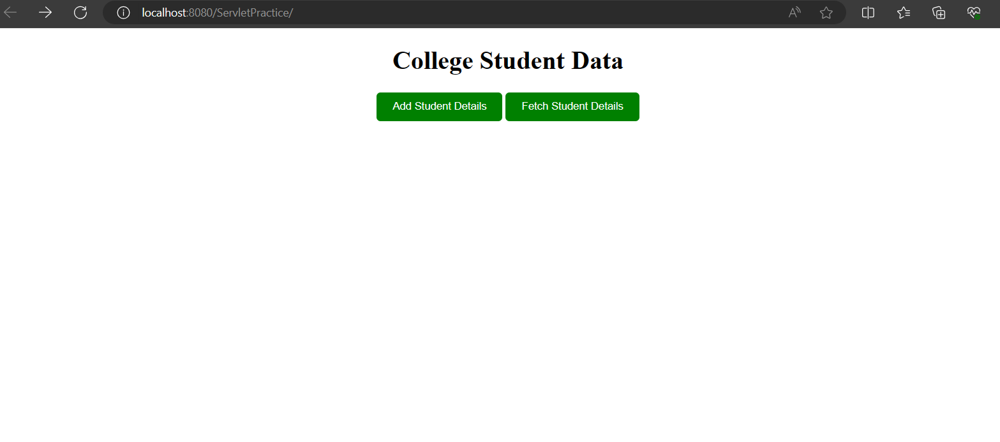

       
                               Overview
This project demonstrates the basic functionality of servlets in Java, focusing on two main operations: registration and data retrieval from a database.

                                 Features
Registration Functionality:

Users can fill out a registration form with their information (name, roll number, marks).
Submitted data is processed by a servlet and inserted into a database table.

Data Retrieval Functionality:

Users can input a roll number to retrieve corresponding data from the database.
The servlet fetches data based on the input roll number and displays it in a dynamic table.

Purpose
The purpose of this project is to provide a hands-on example of servlet development and database interaction using Java. By exploring the registration and data retrieval functionalities, developers can gain insights into building web applications with servlets and managing data persistence.

Technologies Used
Java Servlets
MySQL (or any other database)
HTML
CSS

Feel free to explore the project and its functionalities! If you have any questions or feedback, don't hesitate to reach out. Happy coding!

                               ScreenShots

